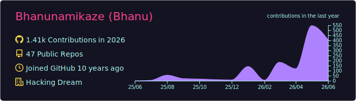
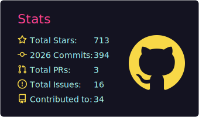
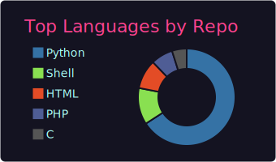
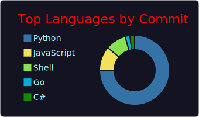

<!-- 
  GitHub Profile README for Bhanunamikaze
  Theme: Cybersecurity / Red Team / Hacker
  
  ⚡ ZERO EXTERNAL DEPENDENCIES ⚡
  All assets are self-hosted in assets/
  Run scripts/download-assets.sh to refresh badges & stats
  GitHub Action workflow auto-refreshes stats & snake
-->

<!-- HEADER: Self-hosted animated SVG -->


<!-- TYPING SVG: Self-hosted CSS animation -->
<div align="center">
  <a href="https://www.hackingdream.net" target="_blank">
    
  </a>
</div>

<br/>

<!-- SEPARATOR -->


<!-- ABOUT SECTION -->
<h2>💀&nbsp; Who Am I</h2>

<table>
<tr>
<td width="50%" valign="top">

<div align="center">
  
</div>

```yaml
name: Bhanu
located_in: Cyberspace
current_role: Red Teamer

focus_areas:
  - Offensive Security & Pentesting
  - Adversary Emulation
  - Exploit Development
  - Malware Development
  - Red Team Tooling Development
  - Security Automation
  
currently:
  working_on: Red Team tools & automation
  learning: Advanced adversary simulation
  blogging_at: www.hackingdream.net
  
fun_fact: >
  I automate what others do manually 
```

</td>
<td width="50%" valign="top">

### 📊 &nbsp; GitHub at a Glance

<a href="https://github.com/Bhanunamikaze" target="_blank">
  
</a>

<br/>

<!-- Self-hosted stats: updated by GitHub Action -->
<div align="center">

| 🔥 Contributions (Year) | 📦 Repositories | 📝 Lines of Code |
|:---:|:---:|:---:|
| **<!--CONTRIBUTIONS-->1397<!--/CONTRIBUTIONS-->** | **<!--REPOS-->60<!--/REPOS-->** | **<!--LOC-->1.0M+<!--/LOC-->** |

</div>

</td>
</tr>
</table>

<!-- SEPARATOR -->


<!-- RED TEAM ARSENAL -->
<!-- RED TEAM ARSENAL -->
<h2>🔴 Red Team Arsenal</h2>

<h3>💀 Malware Dev & Post-Exploitation</h3>
<p>
  <a href="https://github.com/Bhanunamikaze/DPAPI_BOF" target="_blank"></a>
  <a href="https://github.com/Bhanunamikaze/CalderaAgent" target="_blank"></a>
  <a href="https://github.com/Bhanunamikaze/ProcessHollowing" target="_blank"></a>
  <a href="https://github.com/Bhanunamikaze/PHPShell" target="_blank"></a>
  <a href="https://github.com/Bhanunamikaze/FileSpectre" target="_blank"></a>
</p>

<h3>💥 CVEs & Exploit PoCs</h3>
<p>
  <a href="https://github.com/Bhanunamikaze/CVE-2026-2587-Exploit-POC" target="_blank"></a>
  <a href="https://github.com/Bhanunamikaze/BadHost-CVE-2026-48710-Exploit" target="_blank"></a>
  <a href="https://github.com/Bhanunamikaze/CVE-2024-42009" target="_blank"></a>
</p>

<h3>🔍 Vulnerability Scanners & Recon</h3>
<p>
  <a href="https://github.com/Bhanunamikaze/JenkinsVulnFinder" target="_blank"></a>
  <a href="https://github.com/Bhanunamikaze/ESXiBrute" target="_blank"></a>
  <a href="https://github.com/Bhanunamikaze/VMwareAPIPentest" target="_blank"></a>
  <a href="https://github.com/Bhanunamikaze/VaktScan" target="_blank"></a>
  <a href="https://github.com/Bhanunamikaze/AutoRecon" target="_blank"></a>
  <a href="https://github.com/Bhanunamikaze/ProtoScan" target="_blank"></a>
  <a href="https://github.com/Bhanunamikaze/CredArgus" target="_blank"></a>
  <a href="https://github.com/Bhanunamikaze/KronMancer" target="_blank"></a>
  <a href="https://github.com/Bhanunamikaze/RedCore" target="_blank"></a>
  <a href="https://github.com/Bhanunamikaze/PenTest-Scripts" target="_blank"></a>
</p>

<h3>🤖 AI Skills & Dataset Generation</h3>
<p>
  <a href="https://github.com/Bhanunamikaze/Agentic-SEO-Skill" target="_blank"></a>
  <a href="https://github.com/Bhanunamikaze/Code-VulnScan-Skill" target="_blank"></a>
  <a href="https://github.com/Bhanunamikaze/AI-Dataset-Generator" target="_blank"></a>
</p>

<h3>💻 Languages</h3>
<p>
  
  
  
  
  
  
  
</p>


<!-- SEPARATOR -->


<!-- DETAILED GITHUB STATS -->
<h2>📊&nbsp; GitHub Stats</h2>

<!-- Profile Summary Cards - Full Width Details -->
<div align="center">
  
</div>

<br/>

<!-- Summary Cards Row -->
<div align="center">
  
  
  
</div>

<br/>

<!-- SEPARATOR -->


<!-- CONTRIBUTION SNAKE -->
<!-- Generated automatically by .github/workflows/update-stats.yml -->
<h2>🐍 Contribution Snake</h2>

<div align="center">
  <picture>
    <source media="(prefers-color-scheme: dark)" srcset="https://raw.githubusercontent.com/Bhanunamikaze/Bhanunamikaze/output/github-snake-dark.svg" />
    <source media="(prefers-color-scheme: light)" srcset="https://raw.githubusercontent.com/Bhanunamikaze/Bhanunamikaze/output/github-snake.svg" />
    
  </picture>
</div>


<!-- SEPARATOR -->


<!-- CONNECT -->
<h2>🔗&nbsp; Connect With Me</h2>

<div align="center">
  <a href="https://www.hackingdream.net" target="_blank">
    
  </a>&nbsp;
  <a href="https://github.com/Bhanunamikaze" target="_blank">
    
  </a>&nbsp;
  <a href="https://linkedin.com/in/BhanuNamikaze" target="_blank">
    
  </a>&nbsp;
</div>

<br/>

<!-- FOOTER -->

